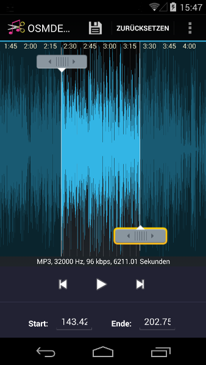

# Ringdroid

A sound editor and ringtone creator for the Android operating system.  
Forked from http://code.google.com/p/ringdroid/

## Screenshot

The screenshot shows the application.

## Contact

ringdroid@google.com

## License

    Copyright (C) 2008 - 2011 Google Inc.

    Ringdroid is licensed under the Apache License, Version 2.0.
    You may not use this source code except in compliance with the License.
    You may obtain a copy of the License at

        http://www.apache.org/licenses/LICENSE-2.0

    Unless required by applicable law or agreed to in writing, software
    distributed under the License is distributed on an "AS IS" BASIS,
    WITHOUT WARRANTIES OR CONDITIONS OF ANY KIND, either express or implied.
    See the License for the specific language governing permissions and
    limitations under the License.
